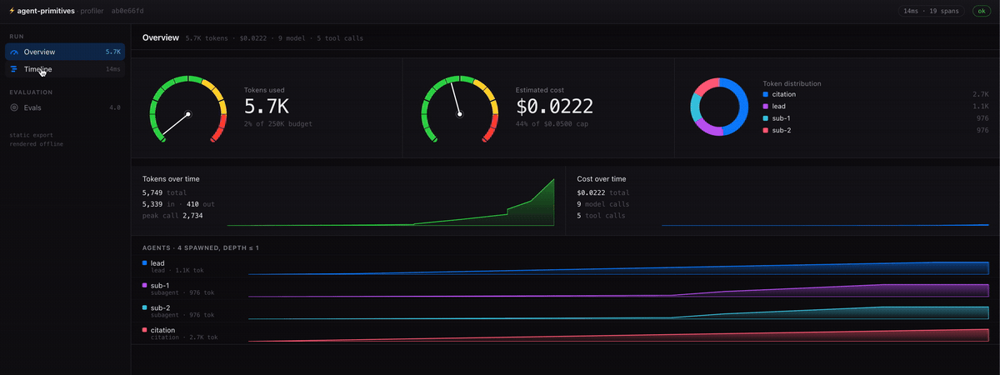
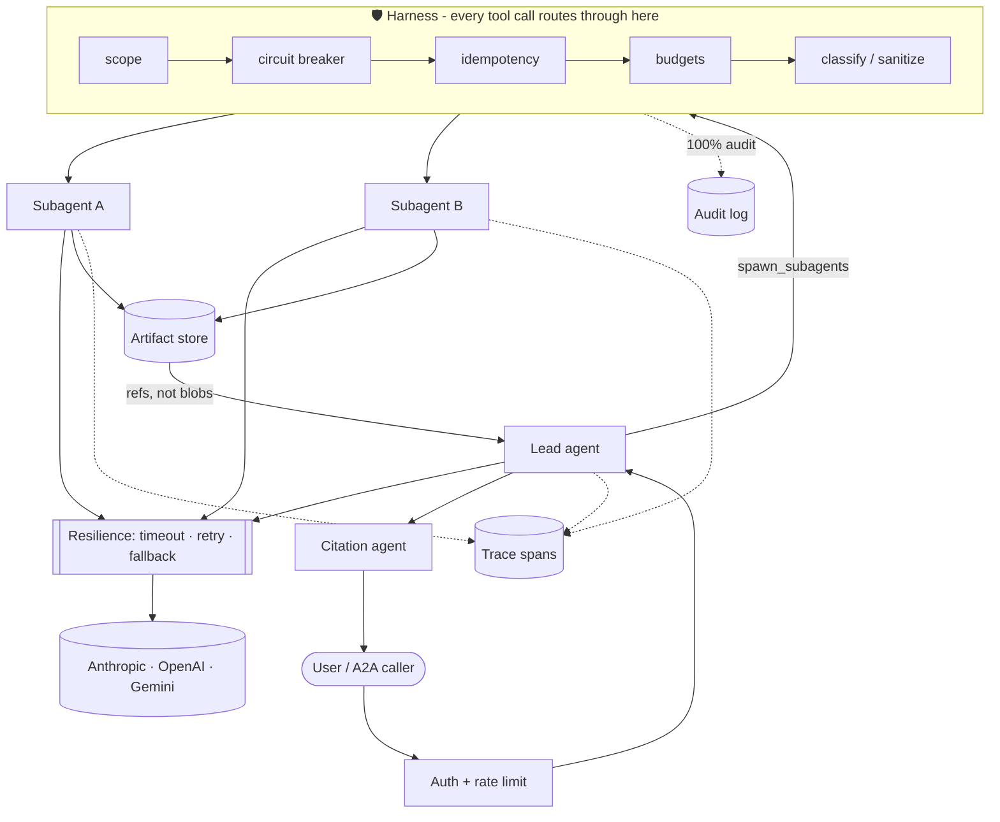
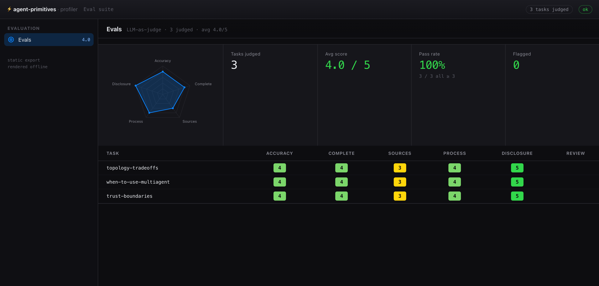

<div align="center">

# ⚡ agent-primitives

### Production multi-agent systems, without surrendering your control loop.

One clone. **Two runtimes** (TypeScript + Python). **Zero API keys** to watch it run.

[](https://github.com/routsom/agent-primitives/actions/workflows/ci-ts.yml)
[](https://github.com/routsom/agent-primitives/actions/workflows/ci-py.yml)
[](https://github.com/routsom/agent-primitives/actions/workflows/parity.yml)
[](https://routsom.github.io/agent-primitives/)


[](LICENSE)

**[📖 Docs](https://routsom.github.io/agent-primitives/) · [🚀 60-second start](#-60-second-start) · [🧠 Why no framework](#-why-not-just-use-a-framework) · [🏗️ Architecture](#-architecture-at-a-glance)**

</div>

---

> ### The model owns judgment. The harness owns guarantees.
> Everything expensive, irreversible, or security-critical lives in deterministic code you can read - not in a system prompt you *hope* holds.

Most multi-agent starter kits are one of two traps: a **thin wrapper** around a single vendor's SDK (locked in), or a **heavyweight framework** that swallows your control loop and hands it back as YAML and callbacks (locked in, differently).

`agent-primitives` is neither. You own the agent loop, the harness, and the orchestration as plain, readable code - with the boring-but-critical reliability machinery already built and tested. Clone it, run it on a mock provider with no keys, then swap in a real model when you're ready to ship.

## 🧠 Why not just use a framework?

|  | LangGraph / CrewAI / AutoGen | Thin SDK wrapper | **agent-primitives** |
|---|:---:|:---:|:---:|
| **Who owns the control loop** | the framework | you (barely) | **you, in plain code** |
| **Multi-LLM** | routing library | one vendor | **thin adapters over official SDKs** |
| **Swap the model** | fight the abstraction | rewrite it | **1 line** |
| **Retry · budgets · circuit breakers · audit** | partial, buried | roll your own | **built in, deterministic** |
| **Durable / resumable runs** | engine-specific | roll your own | **checkpoint + resume, pluggable store** |
| **Human-in-the-loop approval** | callback soup | roll your own | **harness gate, no prompt routes around it** |
| **Deterministic replay (tests)** | rarely | ❌ | **record/replay cassette, zero-token CI** |
| **Profiler dashboard + $ cost** | add-on | ❌ | **Instruments-style, static or live** |
| **Read the whole thing in an afternoon** | ❌ | ✅ | ✅ |
| **TypeScript *and* Python** | rarely | pick one | **both, provably in parity** |
| **Escape cost later** | high | low | **it's just your code** |

No LangChain. No CrewAI. No AutoGen. No routing library. [Here's exactly why](DESIGN.md#why-no-orchestration-framework).

**This is not an anti-framework crusade.** Frameworks exist because building agents from scratch is hard, and they solve real problems - reach for one when prototyping speed matters more than control. The honest trade-off: you can't control the model, its rate limits, or its pricing, so don't pretend to. You *can* own the orchestration, budgets, error policy, and audit trail around it - and `agent-primitives` is what you own when a framework stops fitting. More control means more responsibility: reliability, security, and evolution become *your* readable code instead of someone else's abstraction. And frameworks are welcome *underneath* the line - a LangGraph graph or CrewAI crew plugs in as one governed tool call ([`examples/framework-interop`](typescript/examples/framework-interop)), never running your loop.

---

## 🚀 60-second start

**TypeScript**
```bash
git clone https://github.com/routsom/agent-primitives && cd agent-primitives/typescript
npm install
npm run example:research      # lead agent → parallel subagents → cited answer
```

**Python**
```bash
git clone https://github.com/routsom/agent-primitives && cd agent-primitives/python
uv sync
uv run python -m examples.research_task
```

Both run on a **deterministic mock provider out of the box** - no API key, no account, no network. You'll watch a lead agent decompose a task, fan out parallel subagents (each in its own isolated context), stream a nested trace, and return a cited answer. Add `ANTHROPIC_API_KEY` (or OpenAI / Gemini) to `.env` when you want the real thing.

---

## 🦾 What makes it different

- **🔀 Multi-LLM, no routing library.** Hand-rolled adapters over each vendor's *official* SDK (Anthropic, OpenAI, Gemini) behind one `ChatModel` interface. Swapping providers is a config value, not a rewrite.
- **🛡️ Guarantees, not vibes.** Error classification (`transient · permanent · validation · auth`), a session-wide token budget, provider timeout+retry+fallback, per-tool circuit breakers, and a 100%-coverage audit log - all deterministic harness code with tests. The model decides *what*; the harness decides *whether it's allowed*.
- **💾 Durable, resumable runs.** A subagent is the expensive unit of work, so it's the checkpoint unit: finish one and it's persisted; if the swarm dies partway, re-invoke with the same `runId` and only the unfinished subagents re-run - the rest are restored from their checkpoints (and shown as restored in the trace). The store is a pluggable `CheckpointStore` seam - local files by default, your database or a workflow engine in production.
- **🔗 Frameworks plug in *underneath*.** Already built an agent in LangGraph or CrewAI? Mount it as one governed tool call so it inherits your scoping, budgets, error classification, and tracing - it runs its own loop inside yours, never instead of it. See [`examples/framework-interop`](typescript/examples/framework-interop).
- **📼 Deterministic replay (VCR).** Wrap any provider to record responses to a cassette keyed by request hash, then replay them offline - regression-test the orchestration logic with zero tokens and reproduce a production failure exactly. It's a `ChatModel` decorator, so nothing above the provider layer knows.
- **🙋 Human-in-the-loop, in the harness.** Flag a consequential tool (a payment, a destructive write) and it can't execute without an explicit approval - the gate sits next to scope and budgets so no prompt routes around it. The approve/deny resolver is a seam that composes with checkpoints for suspend-and-resume.
- **🧮 Per-run cost ledger.** Total dollar spend plus a breakdown by model and by agent role, reduced from the trace every run already emits - "what did this run cost, and where?" is one function call, not a spreadsheet.
- **🗜️ Context compaction.** When an agent's history nears the window, collapse the older middle to a summary while keeping the task and recent turns - a primitive a prompt can't self-enforce, with a pluggable (LLM or model-free) summarizer. Off until you enable it.
- **🔌 MCP + A2A wired in, not bolted on.** Mount external MCP servers as tools; expose your agents over Agent-to-Agent with bearer-token auth and rate limiting **at the edge**, before a single token is spent.
- **⚖️ Two runtimes that can't drift.** TypeScript and Python read the *same* `specs/` contracts, and a CI parity check runs the same task in both and diffs the trace tree. Neither language is a second-class citizen.
- **🔍 Review that costs nothing.** `needs_review` is derived from the trace structure (partial completion, unrecovered errors, truncation) - deterministically, with zero extra LLM calls. Your judge gets *triggered* by it, not billed for it.
- **🤖 Agentic-coding native.** `CLAUDE.md`, editor hooks, subagent role definitions, and slash commands ship in the box, not as an afterthought.

And one more thing ... 

In-built instrumental realtime dashboard to monitor almost everything you need. 



---

## 🏗️ Architecture at a glance

Every arrow that carries a tool call passes through the **harness** - the one place that owns guarantees. Agents own judgment; the harness owns what's allowed.



Full sequence + flow diagrams live in the **[docs site](https://routsom.github.io/agent-primitives/architecture/)**.

---

## 📦 What you actually get

| Layer | What it does |
|---|---|
| `providers/` | `ChatModel` adapters over Anthropic / OpenAI / Gemini official SDKs + a mock; resilience decorator (timeout · retry · fallback); **record/replay (VCR)** decorator |
| `harness/` | The guarantees layer: scoping, idempotency, error classification, budgets, circuit breaker, rate limiting, audit log, boundary guardrail, **human-in-the-loop approval gate** |
| `agents/` | Lead agent, parallel subagents, citation agent + deterministic `needs_review` derivation; **context compaction** |
| `orchestrator/` | Synchronous fan-out/fan-in; depth + retry breakers; session token budget; explicit partial-completion policy; **checkpoint + resume** of completed subagents |
| `tools/` · `mcp/` | Typed tool contract with a classified error envelope; MCP client **and** server |
| `a2a/` | Agent-to-Agent server (auth + rate limit) and client |
| `memory/` · `artifacts/` | Plan, artifact, and checkpoint stores behind pluggable `PlanStore` / `ArtifactStore` / `CheckpointStore` seams |
| `cost/` · `tracing/` | Nested spans (turn → agent → call), OTLP export seam, 100% audit stream; **per-run cost ledger** (total + by model + by agent) |
| `evals/` | LLM-as-judge rubric; structural review flags *trigger* the judge |

Every layer exists in **both** `typescript/` and `python/`, reading shared contracts from `specs/`.

---

---

## 📊 A built-in profiler, Instruments-style

Run your agents and get a dashboard - all of it together, from the trace you already emit, as readable code you own. One app with an **Xcode-style left navigator**: gauges for tokens and **real dollar cost**, a token-distribution donut, tokens/cost over time, and per-agent tracks on **Overview**; the full turn → agent → tool call waterfall on **Timeline**. It renders from the trace every run already emits, as a **self-contained HTML file** (zero deps, opens offline) or a **live view that updates in real time** while the run executes.


```bash
npm run example:research        # writes a dashboard.html and opens it
npm run profile                 # live: gauges fill in real time as the run executes
# Python: uv run python -m examples.research_task   ·   PROFILER=live uv run python -m examples.research_task
```

The same app carries an **Evals** view in the navigator - a radar of average score per rubric criterion, pass rate, and a per-task score heatmap - filling in live as each task is judged:



```bash
npm run eval:profile            # live eval dashboard   (static: npm run eval)
```

---

## 🎯 Built for solo devs *and* enterprises

- **Solo / small team:** clone, run the mock example, drop in one provider key, ship. No account, no platform, no lock-in.
- **Enterprise:** least-privilege per-role tool scoping, a deterministic audit trail, provider/region failover, session spend ceilings, resumable runs behind a `CheckpointStore` seam, and OTLP-shaped tracing that drops into your existing observability stack. What's *not* baked in (kill-switch control plane, canary rollout, cross-session memory) is documented as [extension points](https://routsom.github.io/agent-primitives/extending/) with the seam already there - so you wire it your way instead of escaping ours.

---

## 📖 Docs & internals

Full documentation - architecture, providers, MCP, A2A, harness, reliability, tracing, evals, deployment, security, and Claude Code integration - lives at **[routsom.github.io/agent-primitives](https://routsom.github.io/agent-primitives/)** (built from [`docs/`](docs/) with Starlight).

```
specs/          language-agnostic contracts: schemas, prompts, agent roles, MCP/A2A descriptors
typescript/     full runtime · independent build/test/CI
python/         full runtime · independent build/test/CI
reference/      the architecture notes this boilerplate implements
docs/           Starlight documentation site
deploy/         reference Dockerfiles for each runtime
scripts/        check_parity.py - cross-language behavioral parity check
.claude/        Claude Code hooks, subagent roles, slash commands
```

---

## 🤝 Contributing

PRs welcome - just read the one ground rule first: [**no orchestration framework**](CONTRIBUTING.md). Behavior changes start in `specs/` and land in both runtimes; `python3 scripts/check_parity.py` keeps them honest.

<div align="center">

**If this saved you from wiring an agent harness from scratch, drop a ⭐ - it genuinely helps.**

[⭐ Star](https://github.com/routsom/agent-primitives) · [📖 Read the docs](https://routsom.github.io/agent-primitives/) · [🐛 Open an issue](https://github.com/routsom/agent-primitives/issues)

MIT © [routsom](https://github.com/routsom)

</div>
