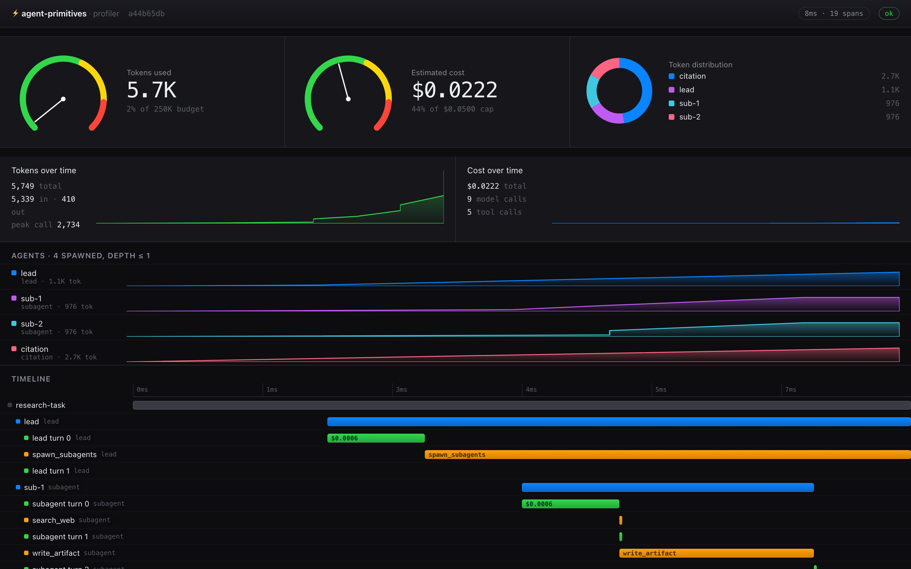

<div align="center">

# ⚡ agent-primitives

### Production multi-agent systems, without a framework hijacking your control loop.

One clone. **Two runtimes** (TypeScript + Python). **Zero API keys** to watch it run.

[](https://github.com/routsom/agent-primitives/actions/workflows/ci-ts.yml)
[](https://github.com/routsom/agent-primitives/actions/workflows/ci-py.yml)
[](https://github.com/routsom/agent-primitives/actions/workflows/parity.yml)
[](https://routsom.github.io/agent-primitives/)


[](LICENSE)

**[📖 Docs](https://routsom.github.io/agent-primitives/) · [🚀 60-second start](#-60-second-start) · [🧠 Why no framework](#-why-not-just-use-a-framework) · [🏗️ Architecture](#-architecture-at-a-glance)**

</div>

---

> ### The model owns judgment. The harness owns guarantees.
> Everything expensive, irreversible, or security-critical lives in deterministic code you can read - not in a system prompt you *hope* holds.

Most multi-agent starter kits are one of two traps: a **thin wrapper** around a single vendor's SDK (locked in), or a **heavyweight framework** that swallows your control loop and hands it back as YAML and callbacks (locked in, differently).

`agent-primitives` is neither. You own the agent loop, the harness, and the orchestration as plain, readable code - with the boring-but-critical reliability machinery already built and tested. Clone it, run it on a mock provider with no keys, then swap in a real model when you're ready to ship.

---

## 📊 A built-in profiler, Instruments-style

Run your agents and get a dashboard - no framework gives you this out of the box. Gauges for tokens and **real dollar cost**, a token-distribution donut, tokens/cost over time, per-agent tracks, and a full turn → agent → tool call waterfall. It renders from the trace every run already emits, as a **self-contained HTML file** (zero deps, opens offline) or a **live view that updates in real time** while the run executes.



```bash
npm run example:research        # writes a dashboard.html and opens it
npm run profile                 # live: gauges fill in real time as the run executes
# Python: uv run python -m examples.research_task   ·   PROFILER=live uv run python -m examples.research_task
```

---

## 🧠 Why not just use a framework?

|  | LangGraph / CrewAI / AutoGen | Thin SDK wrapper | **agent-primitives** |
|---|:---:|:---:|:---:|
| **Who owns the control loop** | the framework | you (barely) | **you, in plain code** |
| **Multi-LLM** | routing library | one vendor | **thin adapters over official SDKs** |
| **Swap the model** | fight the abstraction | rewrite it | **1 line** |
| **Retry · budgets · circuit breakers · audit** | partial, buried | roll your own | **built in, deterministic** |
| **Profiler dashboard + $ cost** | ❌ | ❌ | **Instruments-style, static or live** |
| **Read the whole thing in an afternoon** | ❌ | ✅ | ✅ |
| **TypeScript *and* Python** | rarely | pick one | **both, provably in parity** |
| **Escape cost later** | high | low | **it's just your code** |

No LangChain. No CrewAi. No AutoGen. No routing library. [Here's exactly why](DESIGN.md#why-no-orchestration-framework).

---

## 🚀 60-second start

**TypeScript**
```bash
git clone https://github.com/routsom/agent-primitives && cd agent-primitives/typescript
npm install
npm run example:research      # lead agent → parallel subagents → cited answer
```

**Python**
```bash
git clone https://github.com/routsom/agent-primitives && cd agent-primitives/python
uv sync
uv run python -m examples.research_task
```

Both run on a **deterministic mock provider out of the box** - no API key, no account, no network. You'll watch a lead agent decompose a task, fan out parallel subagents (each in its own isolated context), stream a nested trace, and return a cited answer. Add `ANTHROPIC_API_KEY` (or OpenAI / Gemini) to `.env` when you want the real thing.

---

## 🦾 What makes it different

- **🔀 Multi-LLM, no routing library.** Hand-rolled adapters over each vendor's *official* SDK (Anthropic, OpenAI, Gemini) behind one `ChatModel` interface. Swapping providers is a config value, not a rewrite.
- **🛡️ Guarantees, not vibes.** Error classification (`transient · permanent · validation · auth`), a session-wide token budget, provider timeout+retry+fallback, per-tool circuit breakers, and a 100%-coverage audit log - all deterministic harness code with tests. The model decides *what*; the harness decides *whether it's allowed*.
- **🔌 MCP + A2A wired in, not bolted on.** Mount external MCP servers as tools; expose your agents over Agent-to-Agent with bearer-token auth and rate limiting **at the edge**, before a single token is spent.
- **⚖️ Two runtimes that can't drift.** TypeScript and Python read the *same* `specs/` contracts, and a CI parity check runs the same task in both and diffs the trace tree. Neither language is a second-class citizen.
- **🔍 Review that costs nothing.** `needs_review` is derived from the trace structure (partial completion, unrecovered errors, truncation) - deterministically, with zero extra LLM calls. Your judge gets *triggered* by it, not billed for it.
- **🤖 Agentic-coding native.** `CLAUDE.md`, editor hooks, subagent role definitions, and slash commands ship in the box, not as an afterthought.

---

## 🏗️ Architecture at a glance

Every arrow that carries a tool call passes through the **harness** - the one place that owns guarantees. Agents own judgment; the harness owns what's allowed.


Full sequence + flow diagrams live in the **[docs site](https://routsom.github.io/agent-primitives/architecture/)**.

---

## 📦 What you actually get

| Layer | What it does |
|---|---|
| `providers/` | `ChatModel` adapters over Anthropic / OpenAI / Gemini official SDKs + a mock; resilience decorator (timeout · retry · fallback) |
| `harness/` | The guarantees layer: scoping, idempotency, error classification, budgets, circuit breaker, rate limiting, audit log, boundary guardrail |
| `agents/` | Lead agent, parallel subagents, citation agent + deterministic `needs_review` derivation |
| `orchestrator/` | Synchronous fan-out/fan-in; depth + retry breakers; session token budget; explicit partial-completion policy |
| `tools/` · `mcp/` | Typed tool contract with a classified error envelope; MCP client **and** server |
| `a2a/` | Agent-to-Agent server (auth + rate limit) and client |
| `memory/` · `artifacts/` | Plan + artifact stores behind pluggable `PlanStore` / `ArtifactStore` seams |
| `tracing/` | Nested spans (turn → agent → call), OTLP export seam, separate 100% audit stream |
| `evals/` | LLM-as-judge rubric; structural review flags *trigger* the judge |

Every layer exists in **both** `typescript/` and `python/`, reading shared contracts from `specs/`.

---

## 🎯 Built for solo devs *and* enterprises

- **Solo / small team:** clone, run the mock example, drop in one provider key, ship. No account, no platform, no lock-in.
- **Enterprise:** least-privilege per-role tool scoping, a deterministic audit trail, provider/region failover, session spend ceilings, and OTLP-shaped tracing that drops into your existing observability stack. What's *not* baked in (kill-switch control plane, canary rollout, cross-session memory) is documented as [extension points](https://routsom.github.io/agent-primitives/extending/) with the seam already there - so you wire it your way instead of escaping ours.

---

## 📖 Docs & internals

Full documentation - architecture, providers, MCP, A2A, harness, reliability, tracing, evals, deployment, security, and Claude Code integration - lives at **[routsom.github.io/agent-primitives](https://routsom.github.io/agent-primitives/)** (built from [`docs/`](docs/) with Starlight).

```
specs/          language-agnostic contracts: schemas, prompts, agent roles, MCP/A2A descriptors
typescript/     full runtime · independent build/test/CI
python/         full runtime · independent build/test/CI
reference/      the architecture notes this boilerplate implements
docs/           Starlight documentation site
deploy/         reference Dockerfiles for each runtime
scripts/        check_parity.py - cross-language behavioral parity check
.claude/        Claude Code hooks, subagent roles, slash commands
```

---

## 🤝 Contributing

PRs welcome - just read the one ground rule first: [**no orchestration framework**](CONTRIBUTING.md). Behavior changes start in `specs/` and land in both runtimes; `python3 scripts/check_parity.py` keeps them honest.

<div align="center">

**If this saved you from wiring an agent harness from scratch, drop a ⭐ - it genuinely helps.**

[⭐ Star](https://github.com/routsom/agent-primitives) · [📖 Read the docs](https://routsom.github.io/agent-primitives/) · [🐛 Open an issue](https://github.com/routsom/agent-primitives/issues)

MIT © [routsom](https://github.com/routsom)

</div>
