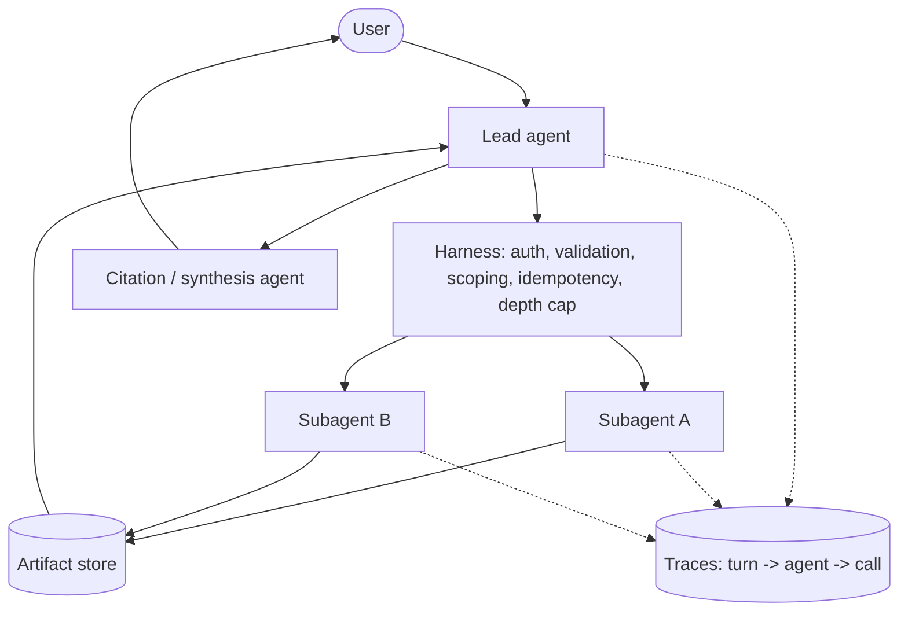

# agent-primitives

A framework-free, multi-LLM boilerplate for building production multi-agent systems.
Clone it, add an API key, and you have a running orchestrator-worker system — lead agent,
parallel subagents, tool harness, MCP, A2A, tracing, evals — in **TypeScript** and **Python**,
side by side, sharing one set of contracts.

[](.github/workflows/ci-ts.yml)
[](.github/workflows/ci-py.yml)
[](.github/workflows/docs.yml)
[](LICENSE)

## Why this exists

Most multi-agent starting points are either a thin wrapper around one vendor's SDK, or a
heavyweight framework that owns your control flow. This is neither:

- **No orchestration framework.** LangGraph, CrewAI, AutoGen, etc. are not dependencies here
  — the agent loop, harness, and orchestration are plain, owned code. See
  [`DESIGN.md`](DESIGN.md#why-no-orchestration-framework) for why.
- **Multi-LLM by design.** Thin adapters over each vendor's *official* SDK
  (Anthropic, OpenAI, Gemini), not a third-party routing layer.
- **MCP and A2A wired in**, not bolted on — mount external MCP servers as tools, expose this
  system's agents over Agent-to-Agent.
- **Grounded in a written architecture**, not ad hoc: every module traces back to a specific
  section of [`reference/multi-agent-architecture-notes.md`](reference/multi-agent-architecture-notes.md).
  See [`DESIGN.md`](DESIGN.md) for the map.
- **Built for agentic coding from day one** — `CLAUDE.md`, hooks, subagent role definitions,
  and slash commands are first-class, not an afterthought bolted on for one tool.

## Architecture at a glance



Full diagrams (sequence + end-to-end flow chart) are in
[`reference/multi-agent-system-diagrams.md`](reference/multi-agent-system-diagrams.md) and the
[docs site](https://routsom.github.io/agent-primitives/).

## Quickstart

### TypeScript

```bash
cd typescript
npm install
cp .env.example .env        # optional: add ANTHROPIC_API_KEY to use a real model
npm run example:research    # runs the full orchestrator-worker flow
```

### Python

```bash
cd python
uv sync
cp .env.example .env        # optional: add ANTHROPIC_API_KEY to use a real model
uv run python -m examples.research_task
```

Both examples default to a **mock provider** — no API key required to see the system run.

## What's in the box

| Layer | Purpose |
|---|---|
| `providers/` | `ChatModel` adapters over Anthropic / OpenAI / Gemini official SDKs, plus a mock for tests |
| `harness/` | Validation, per-role tool scoping, idempotency, delegation-depth cap, tool-call budgets |
| `tools/`, `mcp/` | Typed tool contract; MCP client and server |
| `agents/` | Lead agent, subagents, citation/synthesis agent |
| `a2a/` | Agent-to-Agent server and client |
| `memory/`, `artifacts/` | Durable plan memory, artifact store with lightweight references |
| `orchestrator/` | Synchronous fan-out/fan-in with circuit breakers and partial-completion policy |
| `tracing/` | Nested spans (turn → agent → call), OpenTelemetry-compatible |
| `evals/` | LLM-as-judge with a multi-criteria rubric, CI-runnable |

Both `typescript/` and `python/` implement every layer, reading shared contracts from
`specs/`.

## Individual and enterprise use

- **Individual / small team:** clone, run the mock-provider example, swap in one provider key,
  ship. No account, no platform, no lock-in.
- **Enterprise:** the harness's least-privilege scoping, two-level kill switch, rainbow
  deployment guidance, and OpenTelemetry-compatible tracing (see
  [`DESIGN.md`](DESIGN.md#deployment-posture)) are designed to sit inside existing
  infrastructure and observability stacks rather than replace them.

## Documentation

Full docs (architecture, provider setup, MCP, A2A, harness, tracing, evals, deployment,
Claude Code integration, security): **[docs site](https://routsom.github.io/agent-primitives/)**
— built from [`docs/`](docs/) via Starlight.

## Repository layout

```
specs/          language-agnostic contracts: schemas, prompts, agent roles, MCP/A2A descriptors
typescript/     full runtime, independent build/test/CI
python/         full runtime, independent build/test/CI
reference/      the architecture notes this boilerplate implements
docs/           Starlight documentation site
deploy/         reference Dockerfiles for each runtime
scripts/        check_parity.py - cross-language behavioral parity check
.claude/        Claude Code hooks, subagent roles, slash commands
.github/        CI/CD workflows, issue/PR templates
```

## Contributing

See [`CONTRIBUTING.md`](CONTRIBUTING.md). Read the "no orchestration framework" ground rule
before proposing a new dependency.

## License

[MIT](LICENSE)
