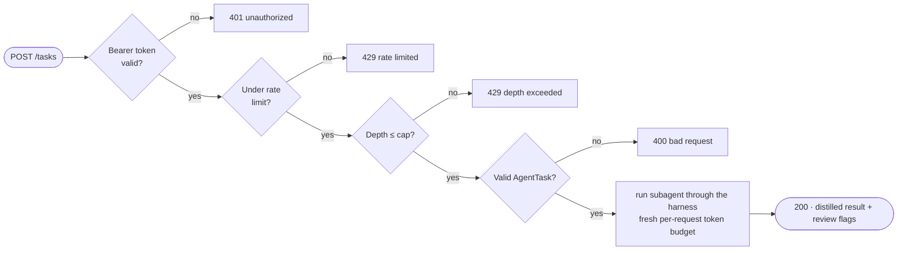

Both runtimes implement a minimal Agent-to-Agent (A2A) server and client on top of plain
HTTP+JSON (Node's `node:http`, Python's `http.server`) rather than a vendored A2A SDK - this
keeps the same "no framework in the way" posture as the rest of the system, and the protocol
surface needed (an agent card plus a task-submission endpoint) is small enough that it doesn't
cost much to own directly. See `specs/protocols/a2a.md` for the full contract.

## An inbound task's path

Auth and rate limiting happen **before** the model runs, so abusive traffic is rejected at
near-zero cost (notes section 19):



The `GET /.well-known/agent.json` card is public discovery metadata and needs no auth.

## Server: exposing an agent

```ts
// typescript
startA2AServer({
  port: 8787, baseUrl: "http://localhost:8787", model, harness, runtime, tracer,
  maxDelegationDepth: 2, authToken: process.env.A2A_AUTH_TOKEN, maxRunTokens: 250000,
});
```

```py
# python
start_a2a_server(A2AServerOptions(
    port=8787, base_url="http://localhost:8787", model=model, harness=harness, runtime=runtime,
    tracer=tracer, max_delegation_depth=2, auth_token=os.environ.get("A2A_AUTH_TOKEN"),
))
```

- **Bearer-token auth** - when `authToken` is set, inbound tasks must present
  `Authorization: Bearer <token>`; unset means unauthenticated (dev only) with a startup warning.
- **Sliding-window rate limit** per caller (token, or remote address) before the request body is
  even read.
- **Fresh per-request token budget** - a long-lived server never accumulates spend across callers.
- Publishes an **agent card** at `/.well-known/agent.json`, generated from
  `specs/agents/subagent.json` - the published capability can never overstate what the agent will
  actually do, because it's read from the same file the local orchestrator enforces against.
- **Every inbound task passes through the harness exactly as a local delegation would** - same
  validation, same depth-cap accounting. "Another agent said so" is not an authorization boundary
  (notes section 7).
- Inbound delegation depth is **added to**, not reset by, the local counter - a remote caller
  can't bypass the [depth cap](/reliability/) by starting a "fresh" count.

## Client: delegating to a remote agent

```ts
const card = await fetchAgentCard("http://localhost:8787");
const result = await delegateToRemoteAgent("http://localhost:8787", task, delegationDepth, authToken);
```

```py
card = await fetch_agent_card("http://localhost:8787")
result = await delegate_to_remote_agent("http://localhost:8787", task, delegation_depth, auth_token=token)
```

A remote agent's response is treated exactly like local subagent output: distilled findings are
used, but nothing in the response is treated as authorization to take any action - the same rule
that applies to tool output and MCP responses.

## Verifying it yourself

Both implementations are exercised end-to-end (not just unit-tested) by starting a real server,
fetching the agent card over HTTP, and delegating a task through it - see each runtime's test
suite for the pattern if you're extending this.
