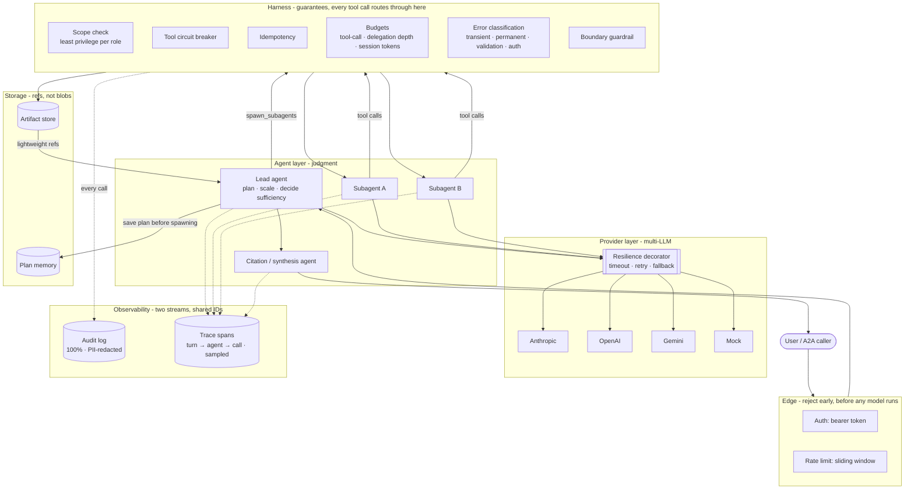
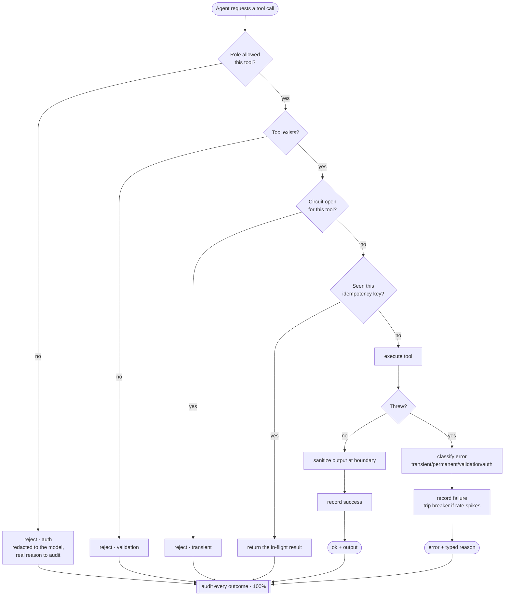

This boilerplate is the runnable, documented embodiment of two source documents shipped in
`reference/` at the repository root:

- **`multi-agent-architecture-notes.md`** - the reasoning: when multi-agent is warranted,
  topology choice, delegation, trust boundaries, cost/latency, failure modes, evals,
  observability, production controls.
- **`multi-agent-system-diagrams.md`** - the shapes: high-level design, sequence diagram,
  end-to-end flow chart.

Nothing here invents new architecture. Every module below exists to make a specific section of
those notes executable, not just describable.

## High-level design

Every arrow that carries a tool call passes through the **harness** - the one place that owns
guarantees (auth, scoping, idempotency, budgets, circuit breaking, audit). Agents own judgment;
the harness owns what's allowed. Provider calls go through a **resilience** decorator; outputs
land in **storage**; and two independent observability streams (audit + trace) fall out of the
same chokepoints.

The harness is shared infrastructure, not duplicated per agent - every agent's tool calls pass
through the same checks. Subagents write large outputs to the artifact store and hand the lead
agent a lightweight reference, not the raw content. See [Reliability & guarantees](/reliability/)
for what each harness stage enforces, and `reference/multi-agent-system-diagrams.md` for the
original companion diagrams.

## A tool call's path through the harness

This is the deterministic gauntlet every tool call runs - the model requests a call, the harness
decides whether and how it happens, and returns a typed outcome (never throws into the loop):

Retryability is *derived from the classified type* (only transient retries), so the orchestrator's
retry loop keys off a structured field - never a regex on an error string.

## Why no orchestration framework

Frameworks like LangGraph, CrewAI, and AutoGen impose their own control flow, state model, and
abstractions between you and the model. That's a reasonable trade for prototyping speed, but it
costs you the ability to reason precisely about token spend, latency, and failure modes - which
the architecture notes treat as the central engineering constraint, not an afterthought. This
boilerplate keeps the agent loop, harness, and orchestration as plain, owned code so every layer
is inspectable and modifiable without fighting a framework's opinions. Multi-LLM support follows
the same principle: thin adapters over each vendor's official SDK, not a routing library that
becomes a second dependency to trust.

## Module map

| Module | Notes section | Responsibility |
|---|---|---|
| `providers/` | §15 | One `ChatModel` interface over each vendor's official SDK; a `ResilientChatModel` decorator adds timeout, retry, and fallback |
| `harness/` | §6-§8, §12, §19, §22 | The guarantees layer: scoping, idempotency, budgets, **error classification**, **per-tool circuit breaker**, **rate limiting**, **audit log**, **boundary guardrail** - every agent routes through it, no shortcuts |
| `tools/`, `mcp/` | §6, §9 | Typed tool contract with a classified error envelope; MCP client and server |
| `agents/` | §3, §9, §16a | `LeadAgent`, `Subagent`, `CitationAgent`, plus **deterministic `needs_review` derivation** from the trace |
| `a2a/` | §7, §19 | Agent-to-Agent server/client; inbound tasks pass through auth + rate limit + the same harness as any local call |
| `memory/`, `artifacts/` | §5 | Plan persisted before spawning; `PlanStore` / `ArtifactStore` seams (local FS default, pluggable) |
| `orchestrator/` | §2, §9, §15 | Synchronous fan-out/fan-in; circuit breakers (depth, retries); **session-level token budget**; partial-completion policy |
| `tracing/` | §11, §12, §18, §22 | Nested spans (turn → agent → call); OTLP export seam; **audit stream kept separate from the eval trace** |
| `evals/` | §10, §16 | LLM-as-judge rubric + seed set; **structural review flags trigger the judge**, they don't wait on it |

## Topology

Orchestrator-worker (lead agent + parallel subagents) is the only topology implemented, per the
notes' default recommendation. Sequential-pipeline and debate patterns are documented as
one-paragraph alternatives, not code - add them only if a concrete task proves the default
insufficient. See `reference/multi-agent-architecture-notes.md` section 2 for the full
comparison.

## Cross-language parity

`specs/` (schemas, prompts, agent role definitions) is the single source of truth both runtimes
read from. This is what keeps `typescript/` and `python/` behaviorally aligned without forcing
them to share a runtime. If you change agent behavior, tool contracts, or prompts, edit `specs/`
first, then update both runtimes to match - `python3 scripts/check_parity.py` (repo root) runs
the research-task example in both runtimes against the mock provider and diffs the resulting
trace span trees (kind, name, role, delegation depth, and status at each nesting level,
ignoring run-specific ids and parallel-sibling ordering) to catch a one-sided edit.

## Deployment posture

`deploy/` and the [Deployment](/deploy/) page cover rainbow deployment, durable/resumable
execution, and a two-level kill switch (whole swarm vs. one agent type) - notes section 12.
These are documented patterns plus Dockerfiles, not a bundled orchestration platform; how you
deploy (Kubernetes, serverless, a single VM) is left to you deliberately, in keeping with
"no vendor control frameworks."
