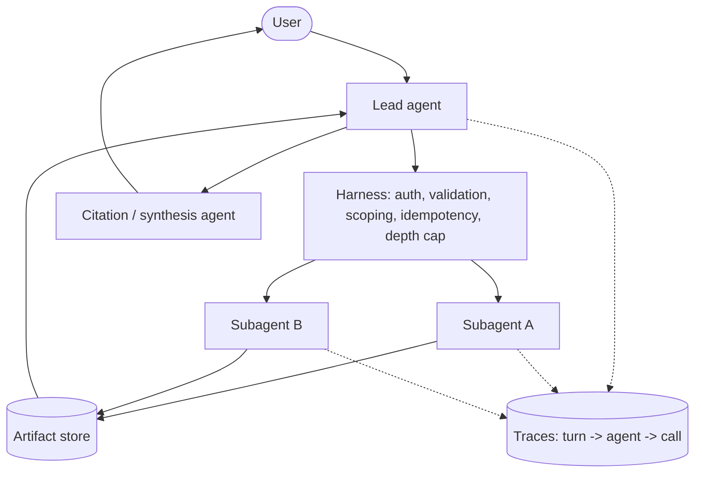

This boilerplate is the runnable, documented embodiment of two source documents shipped in
`reference/` at the repository root:

- **`multi-agent-architecture-notes.md`** - the reasoning: when multi-agent is warranted,
  topology choice, delegation, trust boundaries, cost/latency, failure modes, evals,
  observability, production controls.
- **`multi-agent-system-diagrams.md`** - the shapes: high-level design, sequence diagram,
  end-to-end flow chart.

Nothing here invents new architecture. Every module below exists to make a specific section of
those notes executable, not just describable.

## High-level design

The harness is shared infrastructure, not duplicated per agent - every agent's tool calls pass
through the same auth/validation/idempotency/delegation-depth checks. Subagents write large
outputs to the artifact store and hand the lead agent a lightweight reference, not the raw
content. The full sequence diagram and end-to-end flow chart live in
`reference/multi-agent-system-diagrams.md`.

## Why no orchestration framework

Frameworks like LangGraph, CrewAI, and AutoGen impose their own control flow, state model, and
abstractions between you and the model. That's a reasonable trade for prototyping speed, but it
costs you the ability to reason precisely about token spend, latency, and failure modes - which
the architecture notes treat as the central engineering constraint, not an afterthought. This
boilerplate keeps the agent loop, harness, and orchestration as plain, owned code so every layer
is inspectable and modifiable without fighting a framework's opinions. Multi-LLM support follows
the same principle: thin adapters over each vendor's official SDK, not a routing library that
becomes a second dependency to trust.

## Module map

| Module | Notes section | Responsibility |
|---|---|---|
| `providers/` | - | One `ChatModel` interface over each vendor's official SDK; normalizes messages, tool calls, usage, streaming |
| `harness/` | §6, §7, §8 | Validation, per-role tool scoping, idempotency, delegation-depth cap, tool-call budgets - every agent routes through it, no shortcuts |
| `tools/`, `mcp/` | §6 | Typed tool contract; MCP client (mount external servers as tools) and MCP server (expose this system's tools) |
| `agents/` | §3, §9 | `LeadAgent` (plan, scale subagent count to complexity, judge sufficiency), `Subagent` (isolated context, distill, return a reference), `CitationAgent` (synthesis) |
| `a2a/` | §7 | Agent-to-Agent server/client; inbound A2A tasks pass through the same harness as any other instruction |
| `memory/`, `artifacts/` | §5 | Plan persisted before spawning; phase summaries; artifact store returns lightweight refs, not raw blobs |
| `orchestrator/` | §2, §9 | Synchronous fan-out/fan-in; two circuit breakers (depth, retries); explicit partial-completion policy |
| `tracing/` | §11 | Nested spans: turn → agent → model/tool call; OpenTelemetry-compatible export |
| `evals/` | §10 | LLM-as-judge, multi-criteria rubric, small seed set, runnable in CI |

## Topology

Orchestrator-worker (lead agent + parallel subagents) is the only topology implemented, per the
notes' default recommendation. Sequential-pipeline and debate patterns are documented as
one-paragraph alternatives, not code - add them only if a concrete task proves the default
insufficient. See `reference/multi-agent-architecture-notes.md` section 2 for the full
comparison.

## Cross-language parity

`specs/` (schemas, prompts, agent role definitions) is the single source of truth both runtimes
read from. This is what keeps `typescript/` and `python/` behaviorally aligned without forcing
them to share a runtime. If you change agent behavior, tool contracts, or prompts, edit `specs/`
first, then update both runtimes to match - `python3 scripts/check_parity.py` (repo root) runs
the research-task example in both runtimes against the mock provider and diffs the resulting
trace span trees (kind, name, role, delegation depth, and status at each nesting level,
ignoring run-specific ids and parallel-sibling ordering) to catch a one-sided edit.

## Deployment posture

`deploy/` and the [Deployment](/deploy/) page cover rainbow deployment, durable/resumable
execution, and a two-level kill switch (whole swarm vs. one agent type) - notes section 12.
These are documented patterns plus Dockerfiles, not a bundled orchestration platform; how you
deploy (Kubernetes, serverless, a single VM) is left to you deliberately, in keeping with
"no vendor control frameworks."
