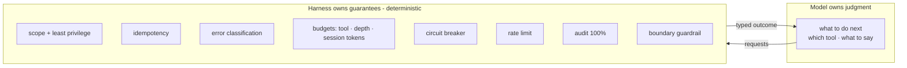

The governing principle (notes section 13): **the model owns judgment; the harness owns
guarantees.** Anything expensive, irreversible, or security-critical is deterministic code, not
a system-prompt hope. This page is the catalogue of those guarantees - each is real code with
tests, in both runtimes.

## Error classification (`harness/errors`)

Every tool failure is classified deterministically into `transient · permanent · validation ·
auth`, and **retryability is derived from the type** (only transient retries). The harness
returns a typed `ToolOutcome` (`ok` / `error` / `rejected`) as *data* - it never throws into the
agent loop - so the orchestrator branches on a structured field, never on a parsed message
string.

| Type | Example | Policy |
|---|---|---|
| `transient` | timeout, 5xx, rate limit | bounded auto-retry, then fail over |
| `permanent` | not found, business-rule violation | no retry, surface as final |
| `validation` | bad input shape | no retry, surface so the model can correct params |
| `auth` | permission failure | no retry; message **redacted to the model** ("not permitted"), real reason kept in the audit log |

## Budgets - three independent circuit breakers

Runaway behavior is a harness concern, not a prompt-level hope (notes section 8, 15):

- **Per-agent tool-call budget** - bounds one agent's tool calls.
- **Delegation-depth cap** - bounds agent-to-agent spawning; A2A depth accumulates across the
  boundary so a remote caller can't reset it.
- **Session token ceiling** (`RunBudget`) - shared across the *entire* run (lead + every
  subagent + citation). Checked before each model call; when exhausted, the agent stops with a
  `partial` result. This is what stops a runaway swarm from spending unbounded tokens even when
  every per-agent cap is still individually within limits.

## Provider resilience (`ResilientChatModel`)

A 429/529 means the model never ran - it needs its own handling, distinct from tool failures
(notes section 15). The resilience decorator wraps any `ChatModel` and transparently: times out
a hung call (classified transient), retries transient failures with exponential backoff, fails
over to a configured fallback model/region, and re-raises non-transient errors immediately.
Nothing above the provider layer knows resilience is happening.

## Per-tool circuit breaker

Distinct from per-subagent retries and from provider resilience, this handles a *tool's backend*
being down system-wide (notes section 12). If a tool's failure rate spikes across all sessions,
the harness marks it open and short-circuits further calls as transient, instead of every
concurrent conversation independently timing out. It half-opens after a cooldown to probe
recovery.

## Rate limiting at the edge (`SlidingWindowRateLimiter`)

Reject abusive or runaway traffic at the earliest point - before the model runs - because the
cost of rejecting early is near zero and rejecting after a full model call is not (notes section
19). The A2A server authenticates (bearer token) and rate-limits per caller *before* touching
the request body.

## Audit is not observability

Two separate streams, shared correlation IDs, different guarantees (notes section 12, 22):

- **Audit log** - 100% of tool calls, PII-redacted params, for compliance and forensics.
  Emitted at the single harness chokepoint, so coverage is structural, not best-effort.
- **Eval trace** - spans for quality measurement, sampled, async.

See [Tracing & audit](/tracing/) for the shapes.

## Derived review flags (`agents/review`)

`needs_review` is set by **structural checks on the trace** - partial completion, an unrecovered
tool error, token truncation, a suspiciously empty answer - not by an LLM judge and not by a
regex on prose (notes section 16a). Zero extra inference. The eval judge is *triggered by* these
flags, so the expensive path only fires on runs a cheap check already flagged.

## Boundary guardrail seam

Tool outputs, other agents' outputs, and inbound A2A tasks are untrusted (notes section 8, 19).
The harness exposes a deterministic `sanitize(boundary, content)` hook applied to tool output
before it reaches the model - the *seam* where app-specific rules go (strip injected
instructions, scrub PII). The default is identity; the rules are yours because they can't be
generic. It is never an LLM call on the safety path.

## Where the guarantees are configured

All of these are options on the `Harness` and `Orchestrator` (and env vars via `config`) - see
[Harness](/harness/) and the `.env.example` in each runtime. Sensible defaults ship on; you
tune the caps and wire the sinks.
