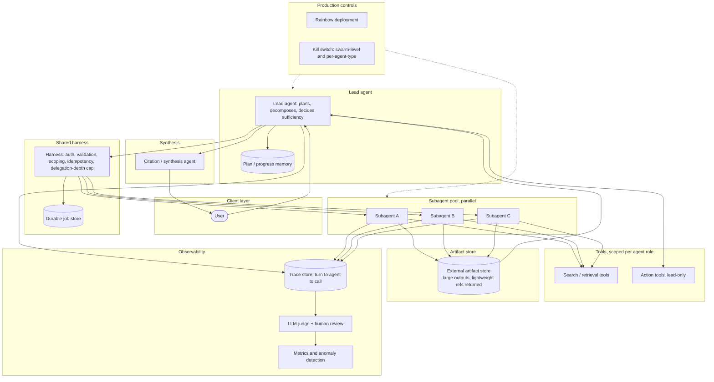
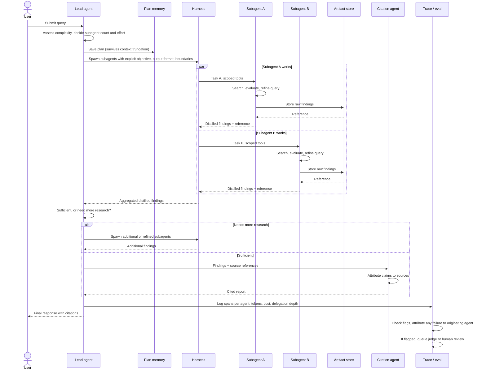
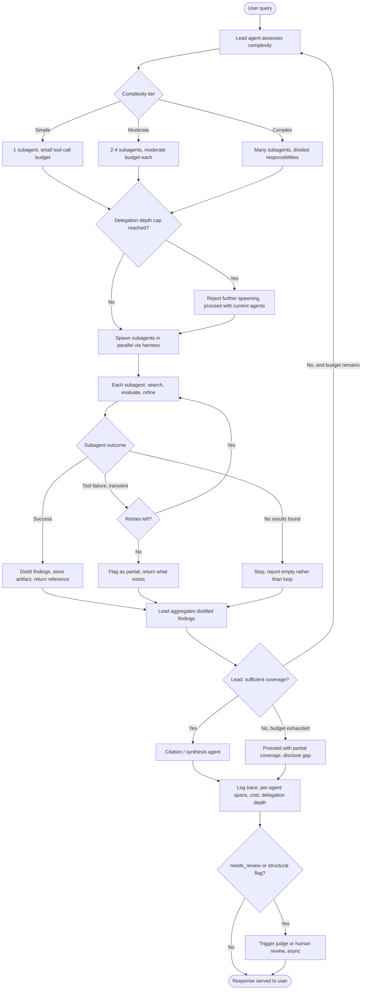

# Multi-agent system diagrams

Companion to `multi-agent-architecture-notes.md`, mirroring the single-agent diagram set. Modeled on the orchestrator-worker topology (lead agent + parallel subagents), the pattern recommended as the default in the notes.

---

## 1. High-level design

**Reading it**: the harness is shared infrastructure, not duplicated per agent — every agent's tool calls pass through the same auth/validation/idempotency/delegation-depth checks, which is what prevents an agent-to-agent shortcut around security (notes section 7). Subagents write large outputs to the artifact store and hand the lead agent a lightweight reference, not the raw content — this is the "avoid the game of telephone" pattern from the notes. Deployment controls apply across both the lead and worker layers because a version change can land mid-execution on either.

---

## 2. Sequence diagram — how the lead and subagents actively integrate

**Reading it**: the `par` block is the parallel fan-out that makes multi-agent worth its token cost — both subagents work simultaneously, not in sequence. Notice the lead agent explicitly decides "sufficient, or need more research" as its own step, rather than subagents deciding autonomously when the whole task is done — that judgment stays centralized. The plan gets saved to memory before any subagent spawns, so a context truncation mid-run doesn't lose the strategy.

---

## 3. Flow chart — end-to-end decomposition and coordination logic

**Reading it**: the delegation-depth cap and the per-subagent retry cap are two distinct circuit breakers, same principle as the single-agent flowchart's two separate breakers — one bounds runaway *spawning*, the other bounds runaway *retrying*. The "no results found" branch is deliberately separate from a tool failure: it's a stopping criterion, not an error, and treating it as an error would push the system toward the unproductive-search-loop failure mode documented in the notes.

---

*Companion to `multi-agent-architecture-notes.md` and, at one level further back, `support-agent-architecture-notes.md` / `support-agent-system-diagrams.md`.*
